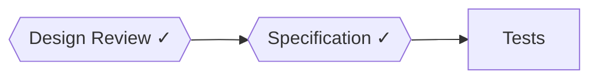
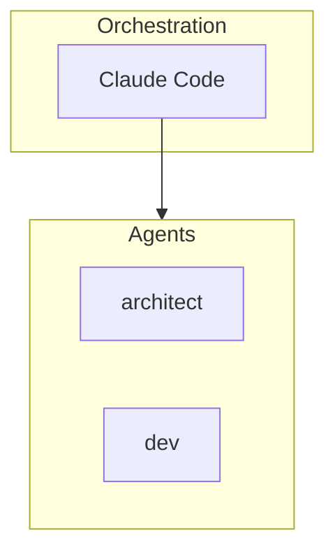
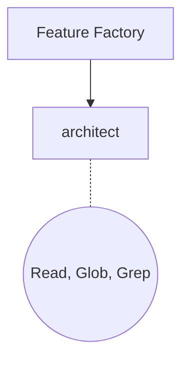

# Doc Generator

Auto-generates API documentation and Mermaid diagrams for Twilio Agent Factory.

## Purpose

The Doc Generator introspects the codebase and generates:

1. **API Documentation** - Tool definitions, parameters, examples in markdown tables
2. **Mermaid Diagrams** - Workflow pipelines, architecture overviews, agent composition

## Architecture

```
src/
├── index.ts              # Main exports
├── types.ts              # TypeScript interfaces
├── extractors/           # Source code parsing
│   ├── mcp-tools.ts      # Extract MCP tool metadata
│   ├── workflows.ts      # Extract workflow definitions
│   └── agents.ts         # Extract agent configurations
└── generators/           # Documentation generation
    ├── api-docs.ts       # Markdown documentation
    └── mermaid.ts        # Mermaid diagram code
```

## Extractors

### mcp-tools.ts

Parses MCP tool files to extract:
- Tool name and description
- Parameter definitions (name, type, required, default)
- Module groupings

**Input:** TypeScript source code with `createTool()` calls
**Output:** `McpToolsExtractorResult` with tools and module summaries

### workflows.ts

Parses Feature Factory workflow files to extract:
- Workflow name and description
- Phase definitions (agent, name, approvalRequired)
- Pre-phase hooks

**Input:** TypeScript source code with `Workflow` objects
**Output:** `WorkflowsExtractorResult` with workflows and hooks

### agents.ts

Parses Feature Factory agent configuration files to extract:
- Agent name and description
- System prompt summary
- Tools, maxTurns, model
- Input/output schemas

**Input:** TypeScript source code with `AgentConfig` objects
**Output:** `AgentsExtractorResult` with agent definitions

## Generators

### api-docs.ts

Generates markdown documentation:

```markdown
# API Reference

## MCP Tools

### Messaging
| Tool | Description |
|------|-------------|
| send_sms | Send an SMS message |

#### send_sms Parameters
| Parameter | Type | Description | Required |
|-----------|------|-------------|----------|
| to | string | Destination number | Yes |

## Agents
| Agent | Description | Tools | Max Turns |
|-------|-------------|-------|-----------|
| architect | Design review | Read, Glob, Grep | 20 |

## Workflows
### new-feature
Full TDD pipeline for new features

**Phases:**
| Phase | Agent | Approval Required |
|-------|-------|-------------------|
| Design Review | architect | Yes |
```

### mermaid.ts

Generates Mermaid diagram code:

**Workflow Pipeline:**


**Architecture Overview:**


**Agent Composition:**


## Usage

```typescript
import {
  extractMcpTools,
  extractWorkflows,
  extractAgents,
  generateApiDocs,
  generateMermaidDiagrams,
} from '@twilio-agent-factory/doc-generator';
import { readFileSync } from 'fs';

// Extract from source files
const toolsSource = readFileSync('agents/mcp-servers/twilio/src/tools/messaging.ts', 'utf-8');
const toolsResult = extractMcpTools(toolsSource, 'messaging.ts');

const workflowSource = readFileSync('agents/feature-factory/src/workflows/new-feature.ts', 'utf-8');
const workflowResult = extractWorkflows(workflowSource, 'new-feature.ts');

const agentSource = readFileSync('agents/feature-factory/src/agents/architect.ts', 'utf-8');
const agentResult = extractAgents(agentSource, 'architect.ts');

// Generate documentation
const apiDocs = generateApiDocs({
  tools: toolsResult.tools,
  agents: agentResult.agents,
  workflows: workflowResult.workflows,
  options: { includeParameters: true },
});

console.log(apiDocs.markdown);
console.log(`Total: ${apiDocs.totalTools} tools, ${apiDocs.totalAgents} agents`);

// Generate diagrams
const diagrams = generateMermaidDiagrams({
  workflows: workflowResult.workflows,
  agents: agentResult.agents,
  includeArchitecture: true,
  includeAgentComposition: true,
  options: { direction: 'LR' },
});

for (const diagram of diagrams) {
  console.log(`\n## ${diagram.title}\n`);
  console.log('```mermaid');
  console.log(diagram.content);
  console.log('```');
}
```

## Type Reference

### Core Types

| Type | Purpose |
|------|---------|
| `ToolDefinition` | MCP tool metadata |
| `AgentDefinition` | Agent configuration |
| `WorkflowDefinition` | Workflow with phases |
| `PhaseDefinition` | Workflow phase |
| `DiagramSpec` | Mermaid diagram output |

### Options

| Type | Purpose |
|------|---------|
| `ApiDocsOptions` | Configure API docs generation |
| `MermaidOptions` | Configure diagram generation |

## Testing

```bash
npm test              # Run unit tests
npm run test:coverage # With coverage report
```

## Related Documentation

- [Root CLAUDE.md](/CLAUDE.md) - Project standards
- [Feature Factory](/agents/feature-factory/CLAUDE.md) - Workflow definitions
- [MCP Server](/agents/mcp-servers/twilio/CLAUDE.md) - Tool implementations
